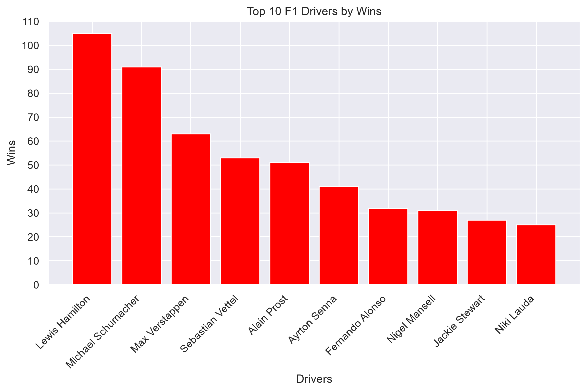
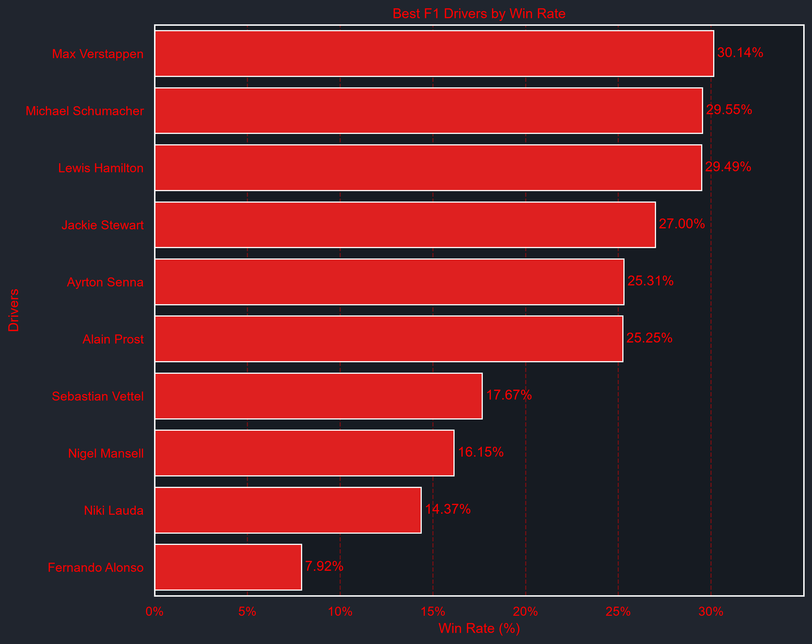
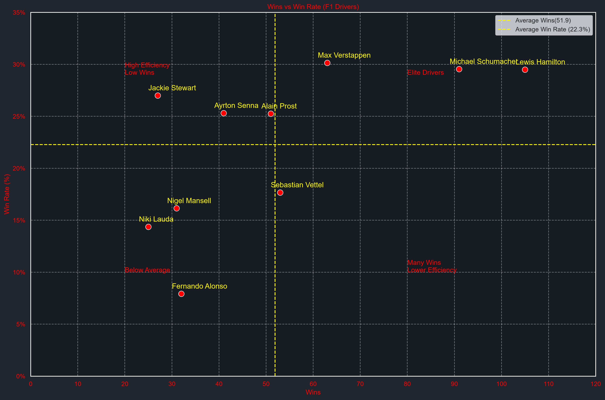

# F1 Race Data Analyzer 🏎️

A data analysis project exploring Formula 1 driver performance using Python, Pandas, Matplotlib, and Seaborn.

## Project Goal

This project answers questions such as:

- Who has the most race wins in Formula 1 history?
- Which drivers are the most efficient at converting races into wins?
- How do wins and win rate compare across legendary drivers?

## Dataset

This project uses the Formula 1 World Championship Dataset by Rohan Rao on Kaggle.

Dataset Link:
https://www.kaggle.com/datasets/rohanrao/formula-1-world-championship-1950-2020

## Tools Used

- Python
- Pandas
- Matplotlib
- Seaborn
- Jupyter Notebook

## Top 10 Drivers by Wins

Using Matplotlib
Using Seaborn.png)

### Key Insight

- Lewis Hamilton leads Formula 1 history with 105 race wins, making him the most successful driver by total victories in the dataset.
- Michael Schumacher remains second with 91 wins, highlighting the longevity of his dominance despite competing in an earlier era.
- Max Verstappen has already reached 63 wins, placing him among the most successful drivers in F1 history while still actively competing.
The gap between the top three and the rest of the field suggests that sustained dominance over multiple seasons is extremely rare in Formula 1.
---

## Top 10 Drivers Win Rate Analysis

### Key Insight

- Max Verstappen records the highest win rate (~30%) among the drivers analyzed, meaning he wins roughly 3 out of every 10 races he enters.
- Lewis Hamilton and Michael Schumacher have slightly lower win rates than Verstappen but achieved their results across significantly longer careers and more race starts.
- Fernando Alonso stands out as an outlier: despite over 400 race starts, his win rate is much lower, illustrating how career longevity and total wins do not always translate to efficiency.
- Win rate provides a different perspective from total wins by emphasizing effectiveness rather than cumulative achievement.

---

## Wins vs Win Rate

### Key Insight

- The scatter plot reveals that wins and win rate are positively related, but the relationship is not perfect.
- Drivers in the top-right quadrant combine both high win totals and high efficiency, representing the most dominant careers in Formula 1 history.
- Drivers with many wins but lower win rates often benefited from exceptionally long careers and large numbers of race starts.
- Drivers with high win rates but fewer total wins demonstrate exceptional efficiency, even if their overall win counts are lower.
- Using average wins and average win rate as reference lines makes it easier to identify drivers who outperform the field on both dimensions simultaneously.

---

## Conclusions

- Total wins measure career achievement.
- Win rate measures competitive efficiency.
- Evaluating both metrics together provides a more balanced view of driver performance.
- Different metrics can lead to different conclusions about who the "best" driver is, highlighting the importance of choosing appropriate evaluation criteria in data analysis.

## Skills Demonstrated

- Data Cleaning
- Data Filtering
- Data Aggregation
- Data Merging
- Feature Engineering
- Data Visualization
- Exploratory Data Analysis (EDA)

## What I Learned

Through this project, I learned:

- Working with real-world datasets
- Data cleaning and filtering using Pandas
- Merging datasets with common keys
- Creating analytical metrics such as win rate
- Building visualizations using Matplotlib and Seaborn
- Drawing insights from data rather than relying on assumptions

## Future Improvements

- Constructor analysis
- Era comparisons
- Nationality analysis
- Interactive dashboard using Plotly
